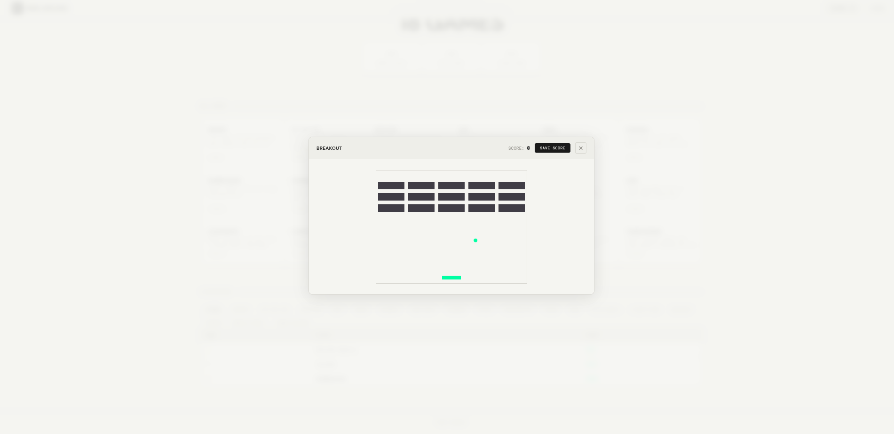

# Mini Arcade V1

okay so this is my first attempt at making a broswer based arcade with mutiple classic games all in one place. built it completly from scratch and im actually pretty proud of how it turned out.

---

## pleease make an acount before jumping into any game or your progres wont be saved.

---

## what is this thing

i built Mini Arcade V1 as a full ready-to-play web exprience. the idea was to make somthing fun but also show off some actual web dev skills at the same time.

**v1 launched with 4 games:**
- Memory Match  flip cards, test your memroy, classic stuff
- Tic Tac Toe  you vs the computer, easy or hard mode
- Reaction Time Tester  see how fast your reflexes actualy are
- Web Dev Quiz  10 real questions about javascript and web stuff, no joke questions

---
**now it have 18 games**

## how i built it 

| thing i used | why i used it |
|---|---|
| HTML5 + CSS3 | base struture and those 3D card flip animatons |
| Tailwind CSS | fast styling without writting a million lines of css |
| Vanilla JavaScript | all the game logic, timers, scoring  no frameworks needed |
| Web Audio API | little sound effects and win noises (no extra files) |
| CSS Animations | smooth transisions and that arcadey pop feeling |

---

## ai usage (being honest here)

look i used ai to *figure stuff out* not to write my code for me.:

- i wanted a database but normal sql stuff was hard to deploy elsewhere so ai helped me find firebase + firestore as a better optin
- used it to understand how auth works in firebase and how to actualy save progres to the cloud
- tried to figure out the leaderboard logic too but tbh its still kinda messy (It's fixed with the new update)

---

## note for hack club reviewrs

so heree's the thing  the first like 18 hours of this project wasnt commited because i didnt know i had to do commits as i go. i only pushed everything after i finished the inital build. from v1.2 onward im doing proper commits for every feture tho so itll be much cleaner going forward

---

## version history

### v1.2
- added 4 new games: Snake, Hangman, Word Scramble, Number Guess
- added acounts so you can actualy log in and share scores with freinds
- gave the whole site a fresh new apperance
- heads up: the theme toggle button has a bug, fixing in 1.3
- also fixed a bunch of other bugs from v1 that were anoying me

### v1.3
- reset the leaderboard logic from scartch (it was a mess before)
- added a bug report form and a game sugestion form so you can reach me directly
- added a litle about me page (dont judge me lol)
- completely redid the database auth because the old one was breaking
- fair warning: the UI looks kinda bad this update. i lost my design inspration midway thru and just pushed it anyway. sorry
- this was genuinly the buggiest update ive ever done. every time i fixed one thing somthing else exploded

### v1.4
- the site was literaly broken after v1.3 because of a bad commit that got synced by accident. had to re-add the files manually
- changed the UI again because everyone hateed the neon theme apparently
- went from 8 games to **18 games**  added a bunch of smaller ones i made for fun and cleaned them up
- leaderboard is actualy working corectly now (finally)
- fixed the auth issue that came with the bad sync
- most bugs are squashed now, enjoy the site :)

---

## screenshots

