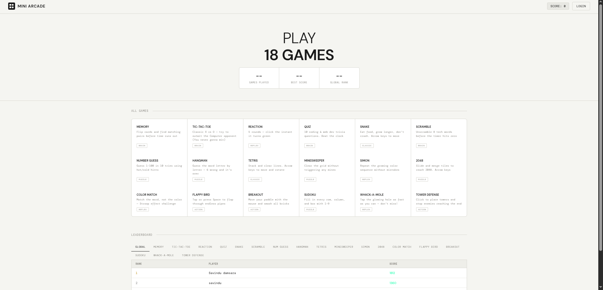

# MINI ARCADE V1

Mini Arcade V1 - this is my first attempt at building a browser-based arcade with multiple classic games. 

---

# IMPORTANT NOTICE 

Before playing any games just create an account or else your progress will be lost.

---

## What This Project Is All About
I built Mini Arcade V1 as a complete, ready-to-play web experience that combines entertainment with practical web development techniques. It’s designed to be:

Right now in V1 you get four games:
- Memory Match – flip cards and test your brain
- Tic Tac Toe – battle a Computer (easy or challenging mode)
- Reaction Time Tester – how fast are your reflexes?
- Web Dev Quiz – 10 questions that actually test real JavaScript & web knowledge

---

## How I Built It (Tech Stuff – Made Simple)

| Technology              | Why I Used It |
|-------------------------|---------------|
| HTML5 + CSS3            | Clean structure and those sweet 3D card flips |
| Tailwind CSS            | Fast, beautiful styling without writing 1000 lines of CSS |
| Vanilla JavaScript      | All the game logic, timers, scoring - powerful and framework-free |
| Web Audio API           | Fun little beeps and win sounds (no extra files needed) |
| CSS Animations          | Smooth transitions and that arcade “pop” feeling |

Core web dev concepts I showed off in V1:
- Event-driven programming
- Dynamic DOM updates
- State management for each game
- Timing systems and win detection
- Modular code (even though it’s one file right now)

---

### AI usage 
 I used AI's help for finding how to do this stuff
 - so i wanted to make a data base but the normal lame one with sql was easier to make but harder to publish in another source so i used firebase and firestore.
 - I used AI to find how to auth with firebase and how to save the progress.
 - And I also used it to know how to check about the leaderboard but I cant figure it out much so it's still kinda messy (Don't worrry i will fix in near future)
 - I wanted a great theme and I used ai to scrape the web for some good UI's I found this on a site and made this project by myself ( I didnt copy the code i took a screen shot of it and coded myself and you know I've looked at some source code too)
 - So overall i used AI to find stuff but i didnt directly copy it and paste it i made them myself in here

 ---

## Special notice for Hack club reviewers 

- So i made this project by myself in vs code and live server i didnt know that i need to make commits as far as i can the first 18 hours of this project is not shown in commits because i made the commits after fully completing the project.

- From the version 1.2 there will be commits for every feature of this site.

---

## Version 1.2 Update 
- I updated the site with 4 more fun games that i think works better 
new games are :
     - Snake
     - Hangman 
     - Word scramble
     - Number guess
- And i made an update so it will be able for you guys to make a account and play so you can share your scores with your friends 
- And a new appearence is given.
- The theme button is happening to have a bug I will fix it on the update 1.3
- The problems and bugs in the project was corrected now everything works fine working on the version 1.3 also.
- There was so many errors in the index.html so i had to use the original formation of files i had to upload as the normal formation it was likely on.

---

## Version 1.3 update 
- Guess what I updated the site again and now these features work much better than the last time.
  
  1. Leaderboard logics are resetted
  2. Ability to send me bug reports and new game suggestions are added 
  3. And a small page about me is added there umm dont worry its just a normal update hehe.
  4. The database authentication logic was also recreated since it had much time 
  5. And I lost my sense of UI designing and now it should look like crap I think you guys wont blame abt it much.
  6. So since you guys can reach me from the site tell me what to add and what to update in the site.

And this was the buggiest update I had ever did to this project. Since it was like when i created a new element and fixed something else just broke.So I hope you guys enjoy the site.

---

## Version 1.4 update 
-The site was basically broken last time since i made a wrong commitment in between the updates and it was synced accidently. And the new files weren't added there but the time was recorded so i added the files without recording time again.

  1. The UI is changed because everyone haates the neone theme.
  2. There was some games made by me for fun I maded some little changes on it and added them here so now there are 18 games.
  3. Leaderboard is functioning correctly now my auth was also wrong with the last sync.
  4. All the bugs are fixed.

Enjoy the site guys 

---

### Some screenshots

